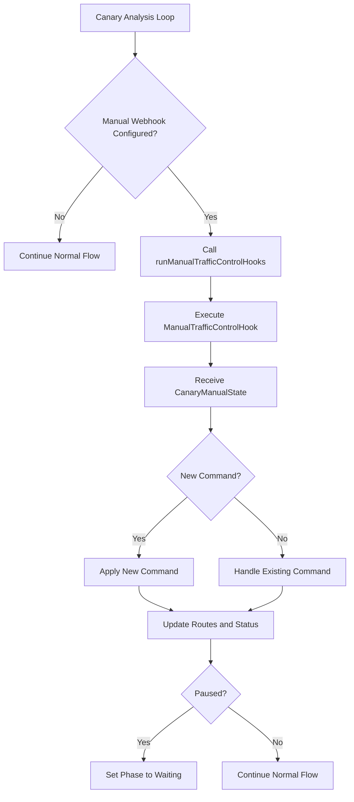

# Manual Webhook Implementation in Flagger

## Overview

The manual webhook system in Flagger allows for manual intervention in canary deployments, enabling operators to pause, resume, or set specific traffic weights during the deployment process. This provides fine-grained control over traffic routing during critical deployment phases.

## Components

1. **Controller** (`pkg/controller/scheduler.go`) - Main logic for handling manual commands
2. **Hook Handler** (`pkg/controller/scheduler_hooks.go`) - Interface with webhooks
3. **Loadtester/External Service** (`pkg/loadtester/server.go`) - External service that can set manual states
4. **API Definitions** (`pkg/apis/flagger/v1beta1/canary.go`, `pkg/apis/flagger/v1beta1/status.go`) - Data structures

## Flow Diagram



## Detailed Flow

1. **Detection**: During the canary analysis loop, the controller checks for manual webhook configuration
2. **Retrieval**: The controller calls `runManualTrafficControlHooks` to get the current manual state
3. **Webhook Execution**: The hook executes the configured webhook and expects a `CanaryManualState` response
4. **Command Validation**: The controller checks if this is a new command using timestamp comparison (`isNewManualCommand`)
5. **Application**: 
   - If new, apply with `applyNewManualCommand`
   - If existing, handle with `handleExistingManualCommand`
6. **Routing**: Update traffic routing with `applyManualWeight` if needed
7. **Status Update**: Update canary status and phase based on manual state
8. **Continuation**: Either pause the canary or continue with normal progression

## Key Functions

### Controller Functions (`pkg/controller/scheduler.go`)

1. **`handleManualStatus`** - Main entry point for manual webhook handling
   - Gets manual state from webhooks
   - Determines if command is new
   - Applies or handles the command
   - Returns whether to pause progression and override normal flow

2. **`isNewManualCommand`** - Checks if a manual command is new based on timestamp
   - Implements idempotency through timestamp comparison
   - Prevents reprocessing of commands with identical timestamps

3. **`applyNewManualCommand`** - Applies a new manual command
   - Sets manual weight if specified
   - Updates canary status with new timestamp
   - Handles resume from paused state

4. **`handleExistingManualCommand`** - Handles existing commands
   - Ensures consistency without reapplying
   - Updates state only when timestamp differs

5. **`applyManualWeight`** - Applies a specific traffic weight
   - Validates weight range (0-100)
   - Updates routes via the mesh router

### Hook Functions (`pkg/controller/scheduler_hooks.go`)

1. **`runManualTrafficControlHooks`** - Executes manual traffic control webhooks
   - Finds webhooks with type `ManualTrafficControlHook`
   - Calls webhook and unmarshals response to `CanaryManualState`

### Loadtester Functions (`pkg/loadtester/server.go`)

1. **`HandleSetManualTrafficControl`** - Sets manual traffic control state
   - Accepts POST requests with `CanaryManualState` in body
   - Extracts canary info from headers
   - Stores state in global store

2. **`HandleGetManualTrafficControl`** - Gets manual traffic control state
   - Accepts POST requests with `CanaryWebhookPayload` in body
   - Returns stored `CanaryManualState`

## Data Structures

### `CanaryManualState` (`pkg/apis/flagger/v1beta1/status.go`)
```go
type CanaryManualState struct {
    Weight    *int   `json:"weight,omitempty"`
    Paused    bool   `json:"paused"`
    Timestamp string `json:"timestamp,omitempty"`
}
```

### `CanaryStatus` (`pkg/apis/flagger/v1beta1/status.go`)
```go
type CanaryStatus struct {
    // ... other fields
    ManualState *CanaryManualState `json:"manualState,omitempty"`
    LastAppliedManualTimestamp string `json:"lastAppliedManualTimestamp,omitempty"`
    // ... other fields
}
```

## Idempotency Mechanism

The system ensures idempotency through timestamp comparison:
1. Each manual command must include a timestamp
2. Commands with identical timestamps are not reprocessed
3. Only commands with lexicographically greater timestamps are applied
4. This prevents replay of old commands and ensures proper ordering

## Error Handling

1. **Webhook Failures**: Logged and returned as errors to stop canary progression
2. **Invalid States**: Validation of weight values (0-100) and required fields
3. **Network Issues**: Retry mechanisms through the webhook infrastructure
4. **Parsing Errors**: JSON unmarshaling errors are caught and logged

## Integration Points

1. **Webhook Configuration**: In the Canary resource under `spec.analysis.webhooks` with type `manual-traffic-control`
2. **External Services**: Any service that can POST to the webhook URL with proper payload
3. **Loadtester**: Built-in implementation for testing and simple use cases

## Usage Example

### Configure Manual Webhook in Canary

```yaml
apiVersion: flagger.app/v1beta1
kind: Canary
metadata:
  name: podinfo
  namespace: test
spec:
  targetRef:
    apiVersion: apps/v1
    kind: Deployment
    name: podinfo
  service:
    port: 9898
  analysis:
    interval: 10s
    threshold: 5
    maxWeight: 100
    stepWeight: 10
    webhooks:
    - name: manual-traffic-control
      type: manual-traffic-control
      url: http://flagger-loadtester.test/traffic/state
```

### Set Manual Traffic Control via Loadtester

To set a specific weight and pause the canary:

```bash
kubectl -n test exec deployment/flagger-loadtester -- \
curl -s -H "Canary-Name: podinfo" -H "Canary-Namespace: test" \
-d '{"weight": 33, "paused": true, "timestamp": "1234567890"}' \
http://flagger-loadtester.test/traffic/
```

To resume the canary at the same weight:

```bash
kubectl -n test exec deployment/flagger-loadtester -- \
curl -s -H "Canary-Name: podinfo" -H "Canary-Namespace: test" \
-d '{"weight": 33, "paused": false, "timestamp": "1234567891"}' \
http://flagger-loadtester.test/traffic/
```

### Custom Webhook Implementation

You can implement your own webhook service to control traffic. The service must:

1. Accept POST requests at the configured endpoint
2. Return a JSON response with the `CanaryManualState` structure:
   ```json
   {
     "weight": 33,
     "paused": true,
     "timestamp": "1234567890"
   }
   ```
3. Ensure the timestamp is unique and increasing for each new command

## Best Practices

1. **Timestamp Format**: Use millisecond precision timestamps to ensure proper ordering
2. **Weight Values**: Keep weight values between 0 and 100 inclusive
3. **Idempotency**: Always include a timestamp to prevent command reprocessing
4. **Response Format**: Ensure webhook responses only include the exact fields defined in `CanaryManualState`
5. **Error Handling**: Return appropriate HTTP status codes for error conditions
6. **Security**: Implement authentication and authorization for production webhook endpoints

This unified and consistent approach to manual traffic control provides operators with fine-grained control over canary deployments while maintaining system integrity through proper idempotency and error handling.